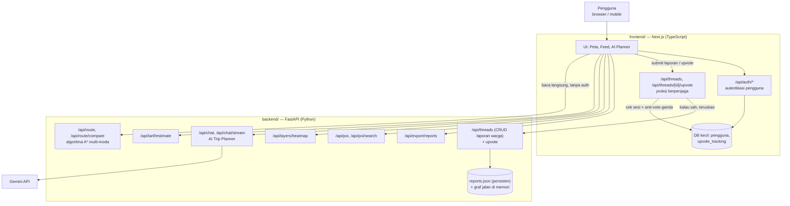

# NGEBOLANG

**NGEBOLANG** (Navigasi, Budgeting, Optimasi Liburan, dan Anggaran) adalah WebGIS yang memadukan **platform sosial mobilitas** bergaya media sosial dengan **AI Trip Planner berbasis percakapan**. Proyek ini dikembangkan tim **GeoSphere** (Universitas Gadjah Mada) untuk kompetisi **MAPID WebGIS Competition #2 2026 — "Maps That Think!"**.

Produk ini menyasar wisatawan dan warga lokal di koridor wisata utama Kota Yogyakarta: **Kraton & Alun-Alun Utara → Titik Nol Kilometer → Jalan Malioboro → Stasiun Tugu → Tugu Yogyakarta**, sepanjang kurang lebih 3–3,5 km.

## Masalah yang diselesaikan

Di koridor ini, perpindahan antar titik wisata hanya dilayani berjalan kaki dan moda *feeder* tradisional (becak, andong, ojek pangkalan) — bukan Trans Jogja atau kendaraan bermotor, karena jaraknya pendek dan sebagian kawasan dibatasi kendaraan. Empat masalah nyata melatarbelakangi produk ini:

1. **Tarif moda tradisional tidak terstandarisasi** — tarif becak/andong ditentukan lewat negosiasi tanpa acuan resmi, menyulitkan wisatawan dan merugikan posisi tawar pengemudi.
2. **Hambatan *first-mile*/*last-mile*** — trotoar yang terputus, tertutup lapak, atau rusak membuat jarak yang secara peta pendek jadi tidak nyaman ditempuh.
3. **Informasi kondisi lapangan tidak tersimpan sebagai data spasial** — laporan warga soal kemacetan, trotoar rusak, atau antrean tersebar di media sosial umum, tidak tergeotag, dan cepat tenggelam.
4. **Platform navigasi umum tidak mencakup moda tradisional** — Google Maps dkk. dirancang untuk kendaraan bermotor/transportasi formal, tanpa estimasi tarif *feeder*, tanpa memperlakukan kualitas trotoar sebagai faktor rute, dan tanpa kanal pelaporan kondisi lapangan.

NGEBOLANG bukan aplikasi navigasi umum, bukan portal pariwisata, dan bukan media sosial umum — melainkan menggabungkan tiga hal yang biasanya terpisah: **perencanaan rute, transparansi tarif, dan pelaporan kondisi lapangan berbasis komunitas**.

## Untuk siapa produk ini

| Persona | Kebutuhan | Fitur yang menjawab |
|---|---|---|
| **Wisatawan** (mis. Dinda, 27 th, dari Jakarta) | Tahu biaya wajar becak/andong; susun rencana jalan-jalan tanpa riset manual lintas aplikasi; tahu kondisi jalur sebelum berangkat | AI Trip Planner, Rute A*, Estimasi Tarif, Peta Sosial Mobilitas |
| **Wisatawan dengan keterbatasan mobilitas** | Hindari jalur rusak/terputus/tidak ramah kursi roda | Rute Ramah Aksesibilitas |
| **Warga lokal & kontributor** (mis. Pak Slamet, pedagang kaki lima) | Laporkan kondisi lapangan agar tersampaikan & tervalidasi, bukan tenggelam di media sosial pribadi | Komposer Laporan, Validasi Komunitas (*upvote*) |
| **Pemerintah daerah** (mis. staf UPT Malioboro) | Pantau sebaran laporan infrastruktur sebagai dasar prioritas perbaikan | Layer laporan di peta, Ekspor Data Agregat |

## Fitur utama

| Kode | Fitur | Deskripsi singkat |
|---|---|---|
| F-01 | **AI Trip Planner** | Chat multi-giliran: rencana rute, info kawasan, info laporan warga, dan pertanyaan lanjutan yang tetap mengacu konteks sebelumnya. Permintaan di luar koridor studi ditolak dengan penjelasan. |
| F-02 | **Rute Multi-Moda (A\*)** | Pencarian rute pada graf pejalan kaki + moda *feeder* (becak/andong/ojek pangkalan), dengan bobot komposit waktu-biaya-jarak dan preferensi hemat/cepat/seimbang/aksesibel. |
| F-03 | **Peta Sosial Mobilitas** | Peta *full-screen* dengan enam layer independen: laporan warga, kepadatan pengunjung, kondisi trotoar, fasilitas & POI, pangkalan becak/andong, dan rute hasil AI Trip Planner. |
| F-04 | **Estimasi Tarif** | Rentang tarif wajar becak/andong berbasis model regresi linear dari data survei lapangan (jarak, moda, akhir pekan), ditampilkan sebagai rentang bukan angka pasti. |
| F-05 | **Komposer Laporan** | Warga membuat laporan (foto, kategori, geotag otomatis, deskripsi) — butuh login. |
| F-06 | **Feed Threads** | Daftar laporan warga per kategori (Info Lalu Lintas, Ulasan Transportasi, Pelaporan Infrastruktur, Diskusi Umum) dengan halaman detail. |
| F-07 | **Validasi Komunitas** | *Upvote* satu suara per pengguna per laporan; laporan yang lolos ambang validasi memengaruhi bobot rute berikutnya. |
| F-08 | **Info Titik & POI** | Popup info saat pin halte/parkir/fasilitas diklik: nama, kondisi, jam operasional, tarif, jarak dari pengguna. |
| F-09 | **Ekspor Data Agregat** | Unduh data laporan (GeoJSON/CSV) dengan filter kategori & rentang waktu — untuk pemangku kepentingan seperti Dishub/UPT. |
| F-10 | **Rute Ramah Aksesibilitas** | Preferensi rute yang menghindari jalur terputus/tangga tanpa *ramp*. |
| F-11 | **Estimasi Kepadatan** | Layer *heatmap* kepadatan per titik populer, dikategorikan Rendah/Sedang/Tinggi, berbeda per slot waktu (pagi/siang/sore/malam). |
| F-12 | **Autentikasi Pengguna** | Wajib hanya untuk membuat laporan (F-05) dan *upvote* (F-07) — menjelajahi peta dan memakai AI Trip Planner tidak perlu login. |

### Bagaimana rute dihitung

Graf jaringan pejalan kaki (OpenStreetMap via OSMnx) ditambah *edge* konektor moda *feeder* berbasis data survei. Algoritma **A\*** mencari kombinasi bobot komposit terendah:

$$w(e) = \alpha \cdot \hat{t}(e) + \beta \cdot \hat{c}(e) + \gamma \cdot \hat{d}(e)$$

dengan α/β/γ mengikuti preferensi (cepat/hemat/seimbang) dan tiap komponen dinormalisasi min-max. Bobot akhir turut memasukkan faktor kemacetan dinamis dan penalti dari laporan warga tervalidasi, sehingga laporan komunitas benar-benar mengubah rute yang direkomendasikan — bukan sekadar informasi pasif di peta.

### Dataset

Fondasi data berasal dari **Community Maps Activity MAPID** (202 titik hasil survei tim bertagar #GeoSphere) di atas basemap **MAPID Maps**, dilengkapi jaringan jalan **OpenStreetMap** (diproses OSMnx) dan tujuh kategori data primer survei lapangan: tarif becak/andong, waktu tempuh jalan kaki, titik transfer antarmoda, kondisi halte/trotoar, aksesibilitas, kepadatan pengunjung, dan fasilitas pendukung.

## Batasan cakupan (MVP)

- Wilayah yang ditampilkan ke pengguna dibatasi pada koridor Kraton–Titik Nol–Malioboro–Tugu, meski backend teknis mendukung wilayah DIY yang lebih luas.
- Trans Jogja ditampilkan sebagai layer POI (halte, jalur), **bukan** sebagai moda dalam perhitungan rute — koridornya terlalu pendek untuk itu.
- Tidak ada sistem pembayaran/pemesanan *feeder*, tidak ada aplikasi mobile native, tidak ada pelacakan posisi kendaraan langsung, dan antarmuka berfokus penuh pada Bahasa Indonesia.

## Prinsip desain produk

- **Satu fokus per layar** — peta, feed laporan, dan AI planner adalah tiga mode terpisah yang bisa diakses cepat, bukan tiga panel yang harus muat bersamaan di layar kecil.
- **Kejujuran atas kepastian** — data yang tidak pasti (tarif becak/andong, status laporan yang masih ditinjau) ditandai jelas sebagai perkiraan, bukan disamarkan seolah pasti.
- **Mobile-first** — pengguna nyata memakai produk ini satu tangan, di jalan, kadang sambil berjalan kaki — bukan dari meja kantor.
- **Aksesibilitas** — target sentuh minimum 44×44px, kontras teks WCAG AA, dukungan `prefers-reduced-motion`, dan status tidak hanya dibedakan lewat warna.

## Arsitektur sistem

Sistem ini terdiri dari dua layanan terpisah yang saling melengkapi, digabungkan di repo ini sebagai **git submodule**:



### `frontend/` — Next.js (TypeScript)

Menangani antarmuka pengguna, peta (MapLibre GL JS di atas basemap MAPID), autentikasi pengguna (F-12), dan **proksi berpenjaga** untuk dua *endpoint* tulis backend (submit laporan, *upvote*) — karena backend Python sendiri tidak memeriksa sesi login atau vote ganda. Sebagian besar *endpoint* baca (rute, chat, tarif, POI, heatmap, feed laporan) dipanggil langsung dari klien ke backend Python tanpa perlu lewat proksi.

### `backend/` — FastAPI (Python)

Mengimplementasikan logika inti: algoritma rute A* multi-moda dengan bobot ternormalisasi (hemat/cepat/seimbang/aksesibel), estimasi tarif becak/andong dari model survei lapangan, AI Trip Planner berbasis Gemini dengan manajemen sesi percakapan (`session_id`), estimasi kepadatan kawasan per slot waktu, serta CRUD penuh laporan warga (kategori, moderasi, *upvote*, ekspor data) yang disimpan persisten ke `community/data/reports.json`. Graf jaringan jalan dibangun ulang di memori setiap *startup* dari data OSM + survei lapangan (by design, karena datanya deterministik).

## Struktur repo

- [`frontend/`](https://github.com/AnthonyS051105/ngebolang-mapid) — Next.js frontend + backend ringan Next.js (autentikasi & proksi)
- [`backend/`](https://github.com/AnthonyS051105/ngebolang-mapid-backend) — Backend Python/FastAPI (routing, tarif, AI chat, laporan warga)

## Live Deploy (untuk panitia/juri)

WebGIS ini sudah *live* dan bisa langsung diakses tanpa perlu clone atau setup apa pun — cukup buka tautan berikut:

**Buka aplikasi: https://ngebolang-mapid.vercel.app/**

Halaman ini adalah antarmuka utama (peta, AI Trip Planner, feed laporan). Backend API sudah otomatis terhubung ke:

- Frontend (Vercel): https://ngebolang-mapid.vercel.app/
- Backend API (Railway): https://ngebolang-mapid-backend-production.up.railway.app

Backend berjalan sebagai layanan API murni (FastAPI) — tidak punya antarmuka visual untuk pengguna akhir, jadi tautannya tidak perlu dibuka langsung oleh juri kecuali ingin memeriksa *endpoint* API secara manual (mis. `GET /api/threads` atau dokumentasi otomatis di `/docs`).

> Catatan: menjelajahi peta dan memakai AI Trip Planner **tidak memerlukan login**. Login hanya diminta saat membuat laporan warga atau memberi *upvote*.

## Clone dengan submodule

```bash
git clone --recurse-submodules https://github.com/AnthonyS051105/ngebolang-system.git
```

Kalau sudah terlanjur clone tanpa `--recurse-submodules`:

```bash
git submodule update --init --recursive
```

## Update submodule ke commit terbaru

```bash
git submodule update --remote --merge
```

## Tim

**GeoSphere** — Universitas Gadjah Mada

| Nama | Peran |
|---|---|
| Brigitta Dyah Ayu Arjanti | Project Leader & GIS Analyst |
| Yohanes Anthony Saputra | WebGIS Developer & UI/UX Designer |
| Nathanael Satya Saputra | Data & AI Analyst |
| Nasywan Dody Kurniawan | Surveyor Lapangan |
| Elok Larasati Widodo | Business/Product Analyst |
