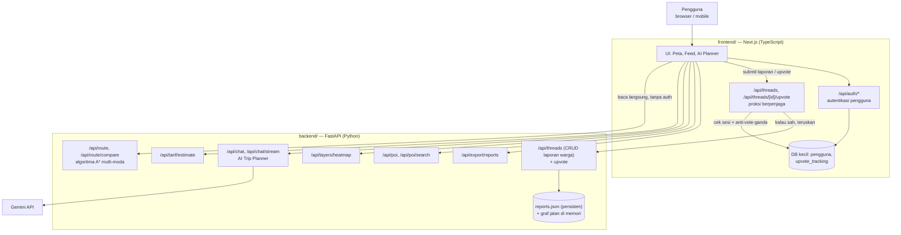

# NGEBOLANG

**NGEBOLANG** adalah WebGIS *trip planner* multi-moda untuk koridor **Kraton – Titik Nol Kilometer – Malioboro – Tugu** di Yogyakarta. Produk ini menggabungkan dua kebutuhan warga dan wisatawan di lapangan: mencari **rute** yang bisa langsung dipakai (bukan sekadar jarak lurus di peta) lengkap dengan estimasi waktu dan tarif, dan **melaporkan kondisi jalan** (macet, banjir, jalan rusak, dll.) secara *crowd-sourced* agar pengguna lain bisa menghindari titik masalah.

Nama "Ngebolang" (jalan-jalan/menjelajah, dalam bahasa gaul Indonesia) mencerminkan visi produk: alat bantu jalan-jalan sehari-hari yang membumi — dibuat oleh warga untuk warga Yogyakarta, bukan dashboard analitik korporat.

## Mengapa proyek ini dibuat

Yogyakarta punya moda transportasi khas (becak, andong) di samping jalan kaki dan moda umum, dengan pola lalu lintas dan kondisi jalan yang berubah-ubah harian. Peta digital umum (Google Maps, dsb.) tidak memodelkan tarif becak/andong maupun kondisi jalan lokal yang dilaporkan warga secara *real-time*. NGEBOLANG mengisi celah ini dengan:

1. **AI Trip Planner berbasis chat** yang memahami bahasa natural ("gimana caranya ke Malioboro dari sini") dan mengembalikan rute siap tampil, bukan cuma teks.
2. **Algoritma rute multi-moda (A\*)** yang mempertimbangkan preferensi hemat/cepat/seimbang, opsi jalan kaki saja, dan opsi ramah aksesibilitas.
3. **Estimasi tarif** becak dan andong berbasis model data survei lapangan, agar pengguna punya gambaran biaya sebelum berangkat.
4. **Peta kepadatan (heatmap)** kawasan berdasarkan waktu (pagi/siang/malam).
5. **Laporan warga (community reports)** dengan moderasi dan *upvote*, sehingga info kondisi jalan tetap segar dan tervalidasi komunitas.

## Prinsip desain produk

- **Satu fokus per layar** — peta, feed laporan, dan AI planner adalah tiga mode terpisah yang bisa diakses cepat, bukan tiga panel yang harus muat bersamaan di layar kecil.
- **Kejujuran atas kepastian** — data yang tidak pasti (tarif becak/andong, status laporan yang masih ditinjau) ditandai jelas sebagai perkiraan, bukan disamarkan seolah pasti.
- **Mobile-first** — pengguna nyata memakai produk ini satu tangan, di jalan, kadang sambil berjalan kaki — bukan dari meja kantor.
- **Aksesibilitas** — target sentuh minimum 44×44px, kontras teks WCAG AA, dukungan `prefers-reduced-motion`, dan status tidak hanya dibedakan lewat warna.

## Arsitektur sistem

Sistem ini terdiri dari dua layanan terpisah yang saling melengkapi, digabungkan di repo ini sebagai **git submodule**:



### `frontend/` — Next.js (TypeScript)

Menangani antarmuka pengguna, peta (MapLibre GL JS di atas basemap MAPID), autentikasi pengguna (F-12), dan **proksi berpenjaga** untuk dua *endpoint* tulis backend (submit laporan, *upvote*) — karena backend Python sendiri tidak memeriksa sesi login atau vote ganda. Sebagian besar *endpoint* baca (rute, chat, tarif, POI, heatmap, feed laporan) dipanggil langsung dari klien ke backend Python tanpa perlu lewat proksi.

### `backend/` — FastAPI (Python)

Mengimplementasikan logika inti: algoritma rute A* multi-moda dengan bobot ternormalisasi (hemat/cepat/seimbang/aksesibel), estimasi tarif becak/andong dari model survei lapangan, AI Trip Planner berbasis Gemini dengan manajemen sesi percakapan (`session_id`), estimasi kepadatan kawasan per slot waktu, serta CRUD penuh laporan warga (kategori, moderasi, *upvote*, ekspor data) yang disimpan persisten ke `community/data/reports.json`. Graf jaringan jalan dibangun ulang di memori setiap *startup* dari data OSM + survei lapangan (by design, karena datanya deterministik).

## Struktur repo

- [`frontend/`](https://github.com/AnthonyS051105/ngebolang-mapid) — Next.js frontend + backend ringan Next.js (autentikasi & proksi)
- [`backend/`](https://github.com/AnthonyS051105/ngebolang-mapid-backend) — Backend Python/FastAPI (routing, tarif, AI chat, laporan warga)

## Live Deploy

- Frontend: https://ngebolang-mapid.vercel.app/
- Backend: https://ngebolang-mapid-backend-production.up.railway.app

## Clone dengan submodule

```bash
git clone --recurse-submodules https://github.com/AnthonyS051105/ngebolang-system.git
```

Kalau sudah terlanjur clone tanpa `--recurse-submodules`:

```bash
git submodule update --init --recursive
```

## Update submodule ke commit terbaru

```bash
git submodule update --remote --merge
```
